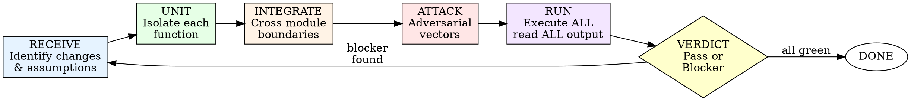

# Adversarial Testing

## Overview

Testing is not about proving code works. Testing is about proving code BREAKS.

**Core principle:** Every test MUST attempt to destroy a specific assumption. If your test only confirms the happy path, it is worthless.

**Violating the letter of this rule is violating the spirit of this rule.**

## The Iron Law

```
NEVER MARK CODE AS TESTED WITHOUT RUNNING REAL TESTS AND SEEING THEM PASS
```

Claimed you tested it? Show the output. No output? Not tested.

**No exceptions:**
- "I read the code carefully" is not testing
- "It's obvious it works" is not testing
- "The types guarantee correctness" is not testing
- "I tested it manually in my head" is not testing

Run the tests. Read the output. See green. Only then is it tested.

## When to Invoke

**ALWAYS for:**
- Any logic change in `src/`
- New module or function
- Refactoring existing code
- Bug fixes (prove the fix AND find siblings)

**NEVER for:**
- Documentation or README changes
- Config file updates (unless config drives logic)
- Cosmetic changes (whitespace, comments, renaming)

## The Adversarial Mindset

You are not a developer confirming your work. You are three adversaries:

**The Attacker:** What inputs can I craft to bypass validation, corrupt state, or escalate privileges? Think injection, overflow, traversal, prototype pollution.

**The Careless User:** What happens when I pass the wrong type, forget a required field, send an empty form, double-click submit, paste garbage from a spreadsheet, or use the app on a 2G connection?

**The Hostile Environment:** What breaks when the database is slow, the disk is full, the network drops mid-request, two users hit the same endpoint simultaneously, or the clock rolls back during DST?

Write tests from ALL THREE perspectives. If you only tested as the developer who wrote the code, you tested nothing.

## Process Flow



### Step 1: RECEIVE — Identify Changes and Assumptions

1. List every changed file and function
2. Identify each assumption the code makes (input types, ranges, ordering, availability)
3. Map dependencies between changed modules
4. For each assumption, write down: "What if this assumption is wrong?"

### Step 2: UNIT — Isolate Each Function

1. Write at least one test per public function
2. Test the contract, not the implementation
3. NEVER mock the unit under test — only its dependencies
4. Each test MUST have a clear name describing the scenario it attacks

### Step 3: INTEGRATE — Cross Module Boundaries

1. Test where data crosses from one module to another
2. Test real dependencies when possible (test databases, not mocks)
3. Verify end-to-end data flow through the changed path
4. Test that error propagation works across module boundaries
5. Test that one module's valid output is another module's valid input

### Step 4: ATTACK — Adversarial Vectors

This is the core. For every function, systematically attack using the full checklist below.

### Step 5: RUN — Execute Everything

1. Execute the FULL test suite — not just new tests
2. Read ALL output line by line — do not skim
3. Check exit code — zero means pass, anything else means fail
4. Count failures and errors separately
5. Investigate warnings — they often hide real bugs

### Step 6: VERDICT

**PASS:** All tests green, exit code 0, no warnings that indicate real problems.

**BLOCKER:** Any failure. List each failure with:
- Test name
- Expected vs actual
- Root cause assessment
- Severity (critical / high / medium)

NEVER downgrade a blocker. NEVER say "probably fine." Fix or escalate.

## Attack Vector Checklist (25 Vectors)

Every function MUST be attacked from these angles. Skip none.

### Data Type Attacks
| # | Vector | What to Test |
|---|--------|-------------|
| 1 | **null / undefined** | Pass null, undefined, missing keys. Does it crash or handle gracefully? |
| 2 | **Empty values** | Empty string `""`, empty array `[]`, empty object `{}`, zero-length buffer |
| 3 | **Wrong types** | String where number expected, object where array expected, boolean where string expected |
| 4 | **Type coercion traps** | `"123"` vs `123`, `"true"` vs `true`, `"0"` vs `0` vs `false`, `[]` vs `""` vs `false` |

### Numeric Attacks
| # | Vector | What to Test |
|---|--------|-------------|
| 5 | **Zero** | Divide by zero, zero-length, zero-count, zero-index |
| 6 | **Negative numbers** | Negative length, negative index, negative price, negative age |
| 7 | **Boundary values** | 0, 1, -1, MAX_SAFE_INTEGER, MIN_SAFE_INTEGER, MAX_SAFE_INTEGER + 1, Infinity, -Infinity, NaN |
| 8 | **Floating point** | 0.1 + 0.2 !== 0.3, rounding errors, currency calculations, epsilon comparisons |

### String Attacks
| # | Vector | What to Test |
|---|--------|-------------|
| 9 | **Unicode / emoji** | `"Hello 🌍"`, RTL text, zero-width joiners, combining characters, surrogate pairs |
| 10 | **Huge inputs** | 1MB string, 10K array elements, deeply nested JSON (100+ levels) |
| 11 | **Special characters** | Newlines, tabs, null bytes `\0`, backslashes, quotes in strings |
| 12 | **Locale-specific** | Date formats (MM/DD vs DD/MM), decimal separators (1.000 vs 1,000), currency symbols |

### Security Attacks
| # | Vector | What to Test |
|---|--------|-------------|
| 13 | **SQL injection** | `'; DROP TABLE users; --`, `' OR '1'='1`, `UNION SELECT` payloads |
| 14 | **XSS payloads** | `<script>alert(1)</script>`, ``, event handler injection |
| 15 | **Path traversal** | `../../etc/passwd`, `..\\..\\windows\\system32`, null byte truncation |
| 16 | **Prototype pollution** | `{"__proto__": {"admin": true}}`, `{"constructor": {"prototype": {}}}` |

### Structural Attacks
| # | Vector | What to Test |
|---|--------|-------------|
| 17 | **Missing fields** | Omit required fields one at a time. Omit all optional fields at once. |
| 18 | **Extra fields** | Add unexpected fields. Does the code ignore them or fail? Can extra fields override internal state? |
| 19 | **Wrong structure** | Array where object expected, flat where nested expected, circular references |
| 20 | **Ordering** | Out-of-order events, unsorted input to code that assumes sorted, duplicate entries |

### Environment Attacks
| # | Vector | What to Test |
|---|--------|-------------|
| 21 | **Concurrency / races** | Parallel calls to the same endpoint, double-submit, read-after-write consistency |
| 22 | **Network failures** | Timeout mid-request, connection reset, DNS failure, partial response |
| 23 | **Resource exhaustion** | Disk full, memory pressure, file descriptor limits, connection pool exhaustion |
| 24 | **Permission denied** | Read-only filesystem, revoked API token, expired session, insufficient role |

### Time Attacks
| # | Vector | What to Test |
|---|--------|-------------|
| 25 | **Temporal edge cases** | Leap years (Feb 29), DST transitions, midnight boundaries, timezone offsets, epoch 0, year 2038 |

## Anti-Patterns

### "Testing only the happy path"
You wrote `test('creates user successfully')` but never `test('rejects user with duplicate email')`. Happy path tests prove nothing — the code was written to handle the happy path. Test the 15 ways it can fail.

### "Writing tests that mirror implementation"
If your test reads like a line-by-line copy of the implementation with assertions, it will break when you refactor but never catch a bug. Test behavior, not implementation. Ask: "If I rewrote this function completely, would the test still be valid?"

### "Mocking everything"
If you mock the database, the HTTP client, the filesystem, and the logger, you are testing whether your mocks return what you told them to return. Use real dependencies in integration tests. Mocks are for isolating the unit under test from its dependencies, not for making tests easy.

### "Testing private methods"
Private methods are implementation details. Test them through the public API. If a private method is too complex to test through the public API, it should be extracted into its own module with its own public API.

### "Testing only what changed"
A change in module A can break module B through shared state, changed interfaces, or altered side effects. Run the FULL suite. Always.

## Red Flags — Rationalizations That Mean "Start Over"

| # | Rationalization | Reality |
|---|----------------|---------|
| 1 | "This is well-tested already" | By whom? Show the output. If you cannot, it is not tested. |
| 2 | "It's just a simple change" | Simple changes cause 40% of production incidents. Test it. |
| 3 | "Tests slow down development" | Debugging in production is slower. Rollbacks are slower. Incident response is slower. |
| 4 | "I'll add tests later" | You will not. "Later" means "never." |
| 5 | "The type system prevents this" | TypeScript types vanish at runtime. JSON.parse returns `any`. External data has no types. |
| 6 | "Edge cases are unlikely" | Unlikely in dev. Guaranteed in production at scale. |
| 7 | "I tested manually" | Manual tests vanish. Cannot re-run. Cannot prove what was tested. |
| 8 | "Mocks are faster" | Fast tests that find no bugs are worse than slow tests that find bugs. |
| 9 | "Integration tests are flaky" | Fix the flakiness. Do not remove the coverage. |
| 10 | "This code is being replaced soon" | "Soon" means 18 months. It will break 6 times before then. |
| 11 | "No one will send that input" | Users, attackers, and upstream services send everything. |
| 12 | "The frontend validates this" | Frontends are bypassed with curl. Server MUST validate. |
| 13 | "It works on my machine" | Your machine is not production. Test portably. |
| 14 | "We have monitoring for this" | Monitoring detects fires. Tests prevent them. |
| 15 | "100% coverage means it's tested" | Coverage measures lines executed, not behaviors tested. 100% coverage with only happy paths is worthless. |

**All of these mean: your testing is incomplete. Go back to Step 4 (ATTACK) and try harder.**

## Restart Triggers — When to Throw Out Tests and Start Over

Delete your tests and restart from Step 1 when:

- **Tests pass but you found a bug manually** — your tests are not adversarial enough
- **All tests passed on first run** — you only tested the happy path
- **Tests break on every refactor** — you tested implementation, not behavior
- **Tests require 50+ lines of setup** — test design is wrong, simplify
- **You cannot explain what each test proves** — vague tests find no bugs
- **Coverage is high but confidence is low** — coverage is not quality
- **Tests mock the unit under test** — you are testing your mocks

Do not patch bad tests. Delete them. Write real ones.

## Integration with Code Review

When the code-reviewer agent reports findings:

1. **For each finding, write a test that would have caught it** — if the reviewer found a null pointer risk, write a test that passes null and verifies the behavior
2. **Add the test to the attack suite** — the reviewer's finding becomes a permanent regression test
3. **Re-run the full suite** — the new test may reveal additional failures
4. **Report back** — tell the reviewer which findings are now covered by tests and which require design changes

Reviewer findings that cannot be tested indicate a design problem. Flag them for redesign.

## Example: Adversarial Test Scenario

**Function under test:** `parseUserAge(input: string): number`

**Happy path test (insufficient):**
```typescript
test('parses valid age', () => {
  expect(parseUserAge("25")).toBe(25);
});
```

**Adversarial test suite (correct):**
```typescript
// Data type attacks
test('rejects null input', () => {
  expect(() => parseUserAge(null as any)).toThrow('Age is required');
});

test('rejects undefined input', () => {
  expect(() => parseUserAge(undefined as any)).toThrow('Age is required');
});

test('rejects empty string', () => {
  expect(() => parseUserAge("")).toThrow('Age is required');
});

// Numeric attacks
test('rejects negative age', () => {
  expect(() => parseUserAge("-5")).toThrow('Age must be positive');
});

test('rejects zero', () => {
  expect(() => parseUserAge("0")).toThrow('Age must be positive');
});

test('rejects age above human maximum', () => {
  expect(() => parseUserAge("200")).toThrow('Age exceeds maximum');
});

test('rejects decimal age', () => {
  expect(() => parseUserAge("25.5")).toThrow('Age must be a whole number');
});

test('rejects MAX_SAFE_INTEGER', () => {
  expect(() => parseUserAge("9007199254740991")).toThrow('Age exceeds maximum');
});

// String attacks
test('rejects non-numeric string', () => {
  expect(() => parseUserAge("twenty")).toThrow('Age must be a number');
});

test('rejects string with spaces', () => {
  expect(() => parseUserAge("  25  ")).toBe(25); // or toThrow, depending on contract
});

test('rejects injection payload', () => {
  expect(() => parseUserAge("25; DROP TABLE users")).toThrow('Age must be a number');
});

test('rejects unicode digits', () => {
  // ٢٥ = Arabic-Indic digits for 25
  expect(() => parseUserAge("٢٥")).toThrow('Age must be a number');
});

// Boundary values
test('accepts minimum valid age (1)', () => {
  expect(parseUserAge("1")).toBe(1);
});

test('accepts maximum valid age (150)', () => {
  expect(parseUserAge("150")).toBe(150);
});
```

One happy path test covers 1 scenario. Fifteen adversarial tests cover 15 ways the function can break. In production, it will encounter all 15.

## Adversarial Testing Checklist

Before marking tests complete, confirm:

- [ ] At least one test per function targets an error path
- [ ] Boundary values tested for every numeric parameter
- [ ] Null/empty tested for every reference parameter
- [ ] At least one test attempts to break type assumptions
- [ ] At least one test uses a security attack vector (injection, traversal, XSS)
- [ ] Integration tests cross at least one module boundary
- [ ] No test exists solely to confirm the happy path without a corresponding failure test
- [ ] Every test name describes the specific scenario it attacks
- [ ] All tests were actually run (not just written)
- [ ] All test output was read line by line (not skimmed)
- [ ] Exit code was checked (zero = pass)
- [ ] Warnings were investigated, not ignored

## The Bottom Line

If you only wrote tests that pass, you did not test. You confirmed your assumptions.

**Write tests that SHOULD fail. Then make them pass. Then find the next way to break it.**

Happy path tests are the floor, not the ceiling. The ceiling is: "I cannot find another way to break this."
